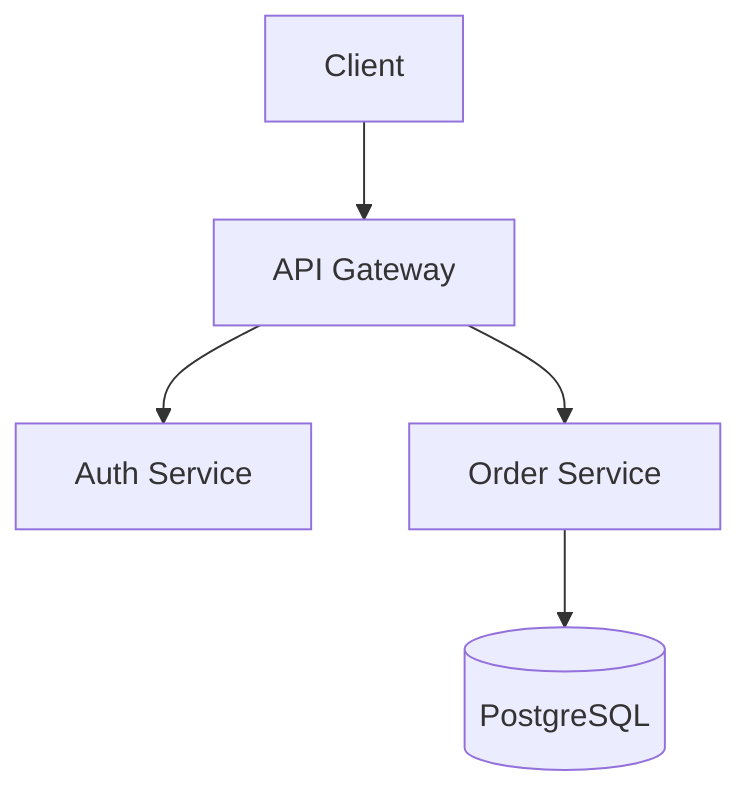

# Skill: system-design

Guides system design discussions, documents the output, and bulk-imports tasks into the backlog from the result.

> `/backlog` is for adding tasks manually one at a time. `/system-design tasks` is for bulk-importing tasks derived from a saved design document.

## Usage

```
/system-design [topic]
/system-design refine [topic]
/system-design tasks [topic]
```

## Behavior

When the first argument is `refine`, run the **Refine** flow.
When the first argument is `tasks`, run the **Tasks** flow.
Otherwise, run the **Design** flow.

---

### Design flow

Walk through each section below step by step. Ask clarifying questions at each step before moving on. Do not skip sections.

#### 1. Requirements
- What are the functional requirements?
- What are the non-functional requirements (latency, throughput, availability, consistency)?
- What scale are we designing for? (users, requests/sec, data volume)

#### 2. High-Level Architecture
- What are the main components/services?
- How do they communicate (sync REST/gRPC vs async Kafka/queues)?
- Draw the architecture using text diagrams.

#### 3. Data Design
- What data needs to be stored?
- SQL vs NoSQL decisions for each entity (and why).
- Schema design, indexing strategy, partitioning/sharding if needed.

#### 4. API Design
- Key endpoints between services and to clients.
- Authentication and authorization approach.

#### 5. Scaling & Performance
- Where are the bottlenecks?
- Caching strategy (what, where, TTL, invalidation).
- Database read replicas, connection pooling, query optimization.
- Horizontal scaling approach.

#### 6. Reliability
- Single points of failure and how to eliminate them.
- Failure modes and graceful degradation.
- Monitoring, alerting, circuit breakers.

#### 7. Save the design

After completing all sections, write the full design to:

```
docs/system-design/{topic-slug}.md
```

Where `{topic-slug}` is the topic in kebab-case lowercase (e.g., `payment-service`).

File structure:

```markdown
# System Design: [Topic]

> Status: draft
> Created: [YYYY-MM-DD]
> Last updated: [YYYY-MM-DD]

## Requirements
...

## High-Level Architecture
...

## Data Design
...

## API Design
...

## Scaling & Performance
...

## Reliability
...

## Open Questions
[Unresolved decisions or trade-offs flagged during the session]
```

After saving, ask the user if they want to generate backlog tasks from this design.

---

### Refine flow

1. Read `docs/system-design/{topic-slug}.md`. If it does not exist, respond: `No design found for "{topic}". Run /system-design {topic} first.`
2. Show a one-sentence summary per section.
3. Ask the user which section to refine or what new concern to address.
4. Discuss interactively, then update the file:
   - Update the relevant section(s).
   - Set `Last updated` to today's date.
   - Append any new unresolved items to `## Open Questions`.
5. After saving, ask if they want to generate or update backlog tasks.

---

### Tasks flow

1. Read `docs/system-design/{topic-slug}.md`. If it does not exist, respond: `No design found for "{topic}".`
2. Analyze the design and derive concrete implementation tasks.
3. For each task, infer feature and context from the design sections (e.g., feature `backend`, context `auth` from API Design).
4. Create tasks following the backlog structure at `docs/backlog/`:

```
docs/backlog/{feature}/{context}/tasks.md
```

Task format:

```markdown
## [Task Title]

**Status:** `todo`
**Description:** [Derived from the design]
**User Story:** As a [user/developer], I want [action] so that [benefit].

[Optional Mermaid diagram if it helps clarify the scope of the task]
```

5. Update `docs/backlog/index.md` after all tasks are written (same rules as the `/backlog` skill).
6. Report how many tasks were created and in which contexts.

---

### Mermaid diagrams

Use Mermaid diagrams to illustrate architecture, data models, and flows. Apply them in the following contexts:

- **High-Level Architecture** — use `graph TD` or `graph LR` to show services and communication paths. Use `C4Context` when the system has external integrations (third-parties, gateways, other services).
- **Data Design** — use `erDiagram` for entity relationships and schema structure. Use `stateDiagram-v2` when an entity has a relevant lifecycle (e.g., order status, payment state).
- **Flows** (within tasks or design sections) — use `sequenceDiagram` for request/response flows, or `flowchart` for decision logic.

Always embed diagrams inside fenced code blocks:

````markdown

````

Include a diagram wherever a visual representation reduces ambiguity. Do not add diagrams for trivial relationships that are clear from text alone.

---

### General rules

- Explain trade-offs for every decision (e.g., "CP vs AP", "SQL vs NoSQL for this use case").
- Use real numbers when estimating (requests/sec, storage in GB, latency in ms).
- Use the technologies present in the project or explicitly requested by the user — do not assume or suggest alternatives unless asked.
- This is a learning exercise — teach me the reasoning, not just the answer.
- Simplicity: avoid premature optimization; keep the design as simple as possible to solve current problems.
- Design for Failure: assume components will fail and incorporate redundancy.
- Use Standardized APIs: REST, GraphQL, or gRPC.
- Include observability (monitoring, logging, alerting) in every design.
- Never overwrite an existing design file without asking first — only `refine` may update it.
- Directory names in kebab-case and lowercase.
